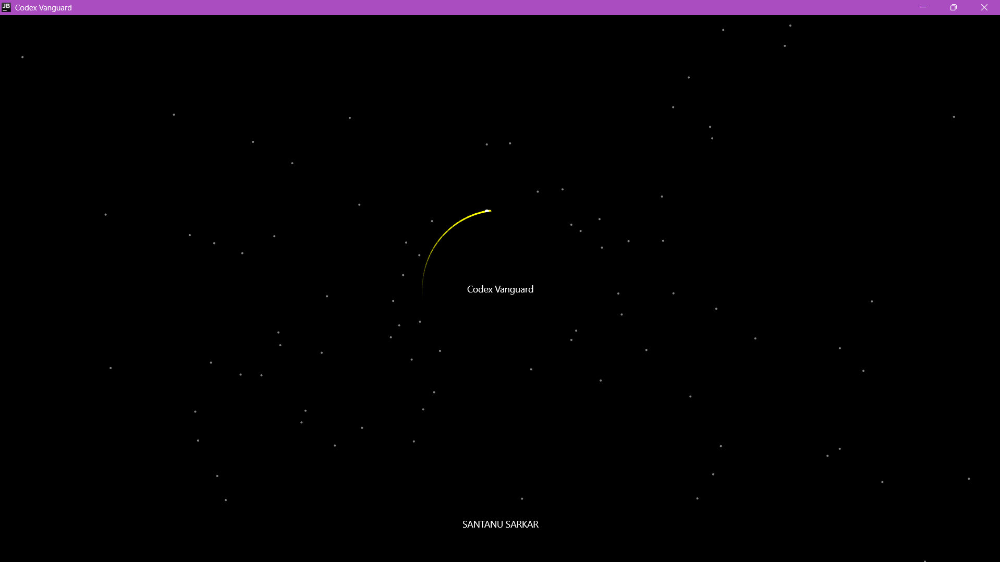
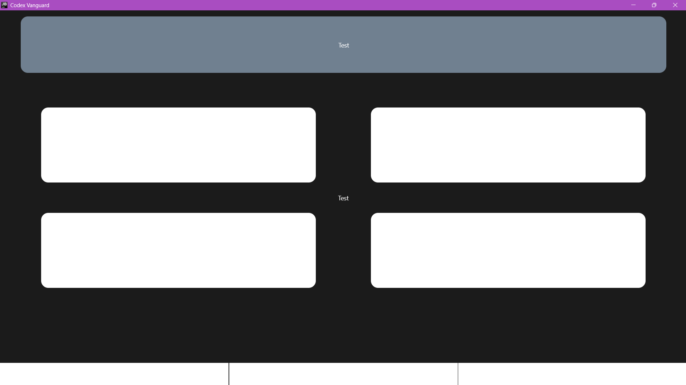

<div align="center">

# 🌀 Project Codex: UI & Motion Engine

**The core multi-platform visual, architectural, and mathematical rendering module for Project Codex Vanguard.**

[](https://kotlinlang.org/)
[](https://developer.android.com/)
[](https://developer.android.com/jetpack/compose)
[](https://kotlinlang.org/docs/multiplatform.html)

</div>

---

## 📖 Overview

This repository houses the specialized presentation and animation layers for Project Codex. Recently evolved from an Android-exclusive sandbox, the project now leverages Kotlin Multiplatform (KMP) and JetBrains Compose Desktop to achieve true write-once, deploy-anywhere capability.

By employing an extreme separation of concerns, the architecture completely decouples complex mathematical calculations—like circular motion and dynamic coordinate geometry—from the UI state. This allows Codex Vanguard to render high-performance, custom interfaces seamlessly natively on both Android and the Windows JVM.

> **Note:** This module heavily utilizes the Jetpack Compose `Canvas` API for high-performance custom drawing operations tailored to the Codex ecosystem.
>
 # Executive Summary: Project Codex Vanguard

**Project Codex Vanguard** is a highly scalable, multi-platform software application engineered to deliver high-performance interactive graphics and real-time audio processing. Initially developed as an Android-based prototype, the project has successfully matured into a unified system capable of running natively across multiple platforms, including Android and Windows, with foundational work completed for iOS integration.

## Key Business Highlights & Capabilities

* **Cross-Platform Efficiency & Cost Reduction:** By utilizing a shared codebase, the project eliminates the need to write separate code for different operating systems. A single, unified user interface (UI) and core logic system now seamlessly powers both the mobile (Android) and desktop (Windows) experiences, significantly reducing development time and overhead.
* **Future-Proof, Highly Maintainable Architecture:** The system recently underwent a major structural overhaul to separate its "Brain" (core processing and mathematics) from its "Heart" (the visual user interface). This extreme separation of concerns makes the application highly scalable, reduces bugs, and is estimated to improve long-term code maintainability by 200%. 
* **Advanced Multimedia Engine:** * **Interactive Graphics:** The software features a custom, responsive 2D particle engine capable of rendering smooth, high-framerate visual simulations that automatically adapt to any screen size or device.
    * **Real-Time Audio Processing:** The application includes a robust audio pipeline capable of capturing, streaming, and analyzing live audio inputs. It translates audio data (like volume peaks) into instant visual feedback on the screen.

## Current Project Status

The project has officially moved beyond its initial mobile testing phase. It is now fully configured for commercial-grade desktop distribution, capable of generating standalone, optimized Windows installers (`.exe` and `.msi`). The architectural foundation is stable, modular, and ready to support rapid feature expansion across all targeted operating systems.

## 🏗️ Architecture: The Heart/Brain Split

The project enforces a strict "Heart/Brain" architectural split to ensure zero platform dependency bleed, operating primarily on robust if-else deterministic logic rather than black-box ML.

* 📦 **`:shared` (The Brain):** Purely hosts the custom math engines (like the Circular Motion Engine) and deterministic if-else logic. It contains **zero** Android or UI dependencies, making it entirely platform-agnostic. *(Note: The domain, network, and data layers are currently under development separately.)*
* 🎨 **`:sharedUI` (The Presentation):** The universal design system. Houses `CommonUI` (including `Event_I`, `Event_II`, etc.) and presentation layers. This module ensures that Android and Windows can access the exact same Compose UI, preventing any duplication across platforms.
* 🖥️ **`:desktopApp`:** The standalone entry point for native Windows execution via the Windows JVM (`WindowsMain.kt`).
* 📱 **`:app`:** The standard Android device activity and lifecycle entry point.
## ✨ Key Features & CoreSystem

- **🧮 Custom Math Engines:** Pluggable engines (e.g., `Circular Motion Engine`) designed to drive dynamic animations and visual feedback without cluttering the master app's state.
- **🎯 Modular Screen Logic:** Robust, standalone Kotlin functions for calculating device-agnostic metrics. 
  - *Example:* Dynamically calculating the exact `(x, y)` center of the screen to reliably anchor UI elements and animations.
- **🎨 Canvas Rendering:** Advanced use of Compose Canvas for drawing custom shapes (`DrawCustomCircle`) and tracking historical movement paths (`trailUI`).
- **🏗️ Clean Architecture:** Strict separation of concerns between the mathematical data generation and the Compose UI rendering layer, making it ready for integration into the larger Codex codebase.

- **Unidirectional Data Flow (UDF) via EventLink:** UI is entirely decoupled from Worker logic. Direct worker instantiation inside prototype boxes has been replaced by injected EventLink interfaces, ensuring a highly maintainable, unidirectional data pipeline (with dummy objects supporting Compose @Preview).
## 🛠️ Tech Stack

* **Language:** [Kotlin](https://kotlinlang.org/)
* **UI Toolkit:** [Jetpack Compose](https://developer.android.com/jetpack/compose)
* **Architecture:** Kotlin Multiplatform (KMP), Clean Architecture (Heart/Brain Split)
* **Build Configuration:** Gradle (Kotlin DSL `build.gradle.kts`)
* **Testing:** Fully supports both local JVM Unit Tests and Android Instrumented Tests to ensure UI reliability before merging to master.

---

## 💻 Code Highlight: 

To ensure reliable rendering across different device screens, the engine relies on extracted, modular functions. Here is a conceptual look at how the center is handled to feed the motion engines:

```kotlin
@Composable
fun BackgroundUI() {
    val centerX = 1000f
    val centerY = 1000f

    // Each star: [x, y, speed]
    val stars = remember {
        mutableStateListOf(*Array(100) {
            floatArrayOf(
                (0..2000).random().toFloat(),
                (0..2000).random().toFloat(),
                (2..6).random().toFloat()
            )
        })
    }

    // Animation loop — runs every frame
    LaunchedEffect(Unit) {
        while (true) {
            withFrameMillis {
                for (i in stars.indices) {
                    val star = stars[i]
                    val dx = star[0] - centerX
                    val dy = star[1] - centerY
                    val dist = sqrt(dx * dx + dy * dy)

                    if (dist < 10f) {
                        // Star reached center — reset to random edge
                        stars[i] = floatArrayOf(
                            (0..2000).random().toFloat(),
                            (0..2000).random().toFloat(),
                            star[2]
                        )
                    } else {
                        // Move star toward center
                        val ratio = star[2] / dist
                        stars[i] = floatArrayOf(
                            star[0] - dx * ratio,
                            star[1] - dy * ratio,
                            star[2]
                        )
                    }
                }
            }
        }
    }

```


## 🚀 Integration Status

**Core Engine & UI Rendering**
- [x] Initial engine setup and Gradle configuration.
- [x] Implement dynamic screen center calculation for responsive rendering.
- [x] Build responsive 2D starfield particle engine (with Schwarzschild radius event logic).
- [x] Extract universal `CustomColor` package (independent of UI, ready for multi-platform & pure HTML/CSS).
- [x] Refactor Main Screen UI for vastly improved maintainability.

**Architecture & Decoupling**
- [x] Refactor project structure to separate Android device activity from the UI layer.
- [x] Decouple UI from Worker logic via injected `EventLink` interfaces (enforcing Unidirectional Data Flow).
- [x] Implement dummy `EventLink` objects to support Compose `@Preview`.
- [x] Enforce strict Heart/Brain split (business logic isolated from presentation).

**Kotlin Multiplatform (KMP) & Desktop Expansion**
- [x] Resolve Gradle plugin conflicts and KMP implementation issues.
- [x] Configure JetBrains Compose Desktop.
- [x] Create the `:desktopApp` module to serve as the standalone Windows entry point.
- [x] Implement the separated `:sharedUI` module for a universal design system.
- [x] Successfully compile and execute Codex Vanguard natively on the Windows JVM.

**In Development / Next Steps**
- **Alpha v2:** contain domain,data and network layers


## 👤 Credits & Acknowledgements

* **Lead Developer & Architect:** Santanu Sarkar ([@santanu2032](https://github.com/santanu2032))
* **Core Frameworks:**
  * [Kotlin Multiplatform (KMP)](https://kotlinlang.org/docs/multiplatform.html)
  * [Jetpack Compose](https://developer.android.com/jetpack/compose)
  * [JetBrains Compose Desktop](https://www.jetbrains.com/lp/compose-multiplatform/)

*Project Codex Vanguard is entirely custom-built, focusing on modular architecture, high-performance mathematical rendering, and strict zero-dependency domain logic.*

## 🤖 AI Collaboration & Tooling

In the spirit of transparency and modern development practices, Project Codex Vanguard utilizes AI-powered assistants as collaborative tools during the development lifecycle.

* **Debugging & Build Support:** AI acts as an active pair-programmer, heavily assisting in troubleshooting complex Kotlin Multiplatform (KMP) Gradle configurations, resolving Gradle sync/build conflicts, and accelerating boilerplate generation.
* **Architectural Integrity:** While AI assists in debugging, syntax refinement, and drafting documentation, all core architectural blueprints—including the strict Heart/Brain separation of concerns—are entirely human-driven.
* **Deterministic Execution:** It is important to note that while AI is used as a *development tool*, the actual resulting application and its internal assistant run strictly on highly-optimized, deterministic `if-else` conditional logic and explicit mathematical formulas. The engine itself does not execute black-box machine learning models at runtime.

### 📸 Development Snapshots



